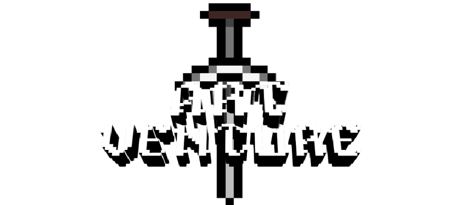

# Art'Venture
Dans ce jeu, vous explorez un musée interactif avec des mini-jeux sur le thème de l'art. Chaque défi vous permet de découvrir des techniques, des artistes célèbres et l'histoire de l'art, tout en vous amusant. C'est une expérience à la fois éducative et divertissante.

## Auteurs

- Anthony ibanez
- Raphaël Prost
- Aelys Coleen Surma Valtaer
- Louis Gagne
- Mathéo Faure


## Installation

Installez le projet avec pip :

```bash
    pip install -r requirements.txt 
```

    
## Leçons apprises

- Pygame : animations, son, menus, collisions, interfaces ...
- Gestion des objets, classes et héritages
- Utilisation de Tiled, gestion de la caméra, optimisation ...
- Travail en groupe : projet avec GitHub, collaboration ...

## License

[GPL-3](https://choosealicense.com/licenses/gpl-3.0/)
